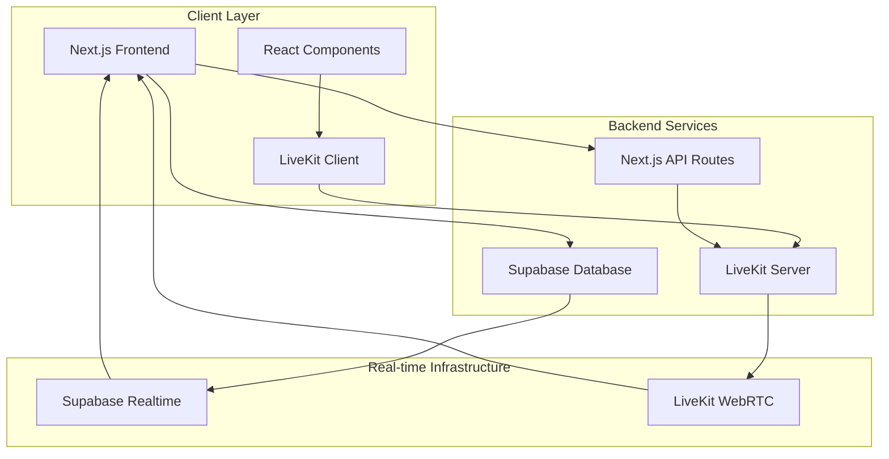
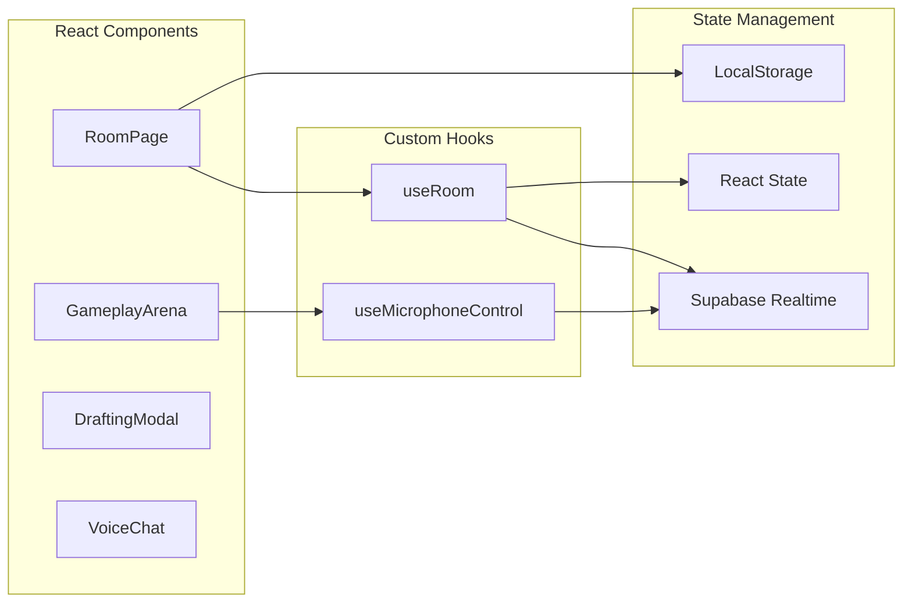
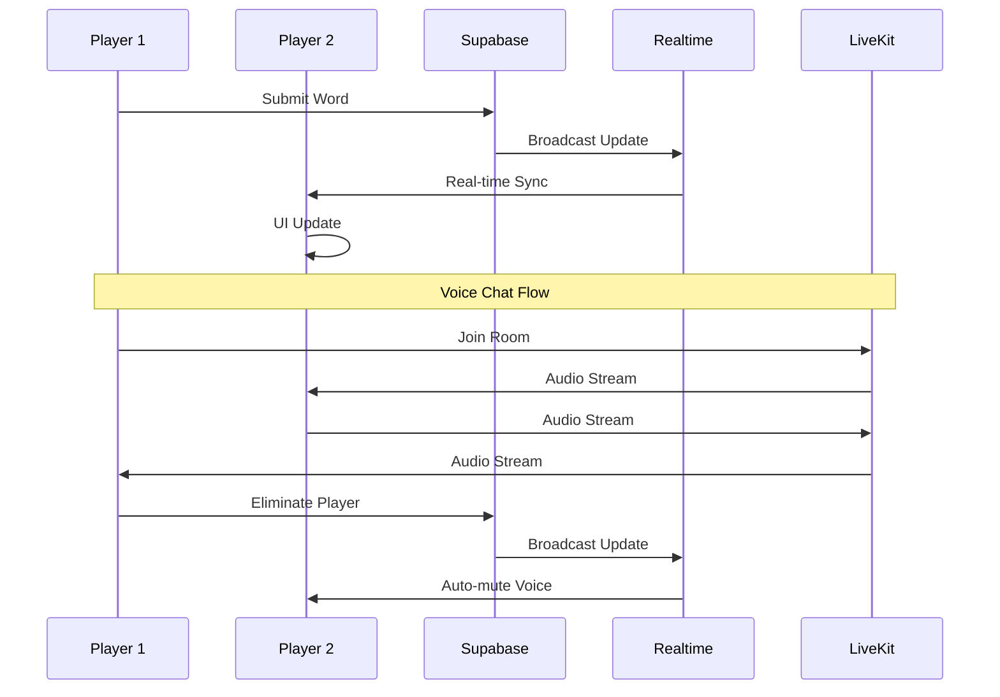
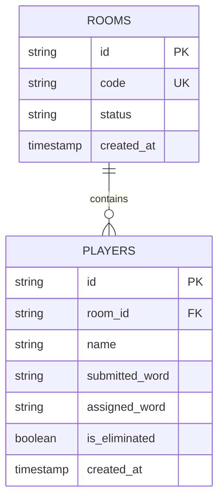

# 🎮 Loodpak - Real-time Voice Chat Game

A modern web-based multiplayer game where players must avoid saying their assigned forbidden words. Features real-time voice chat, automatic word assignment using derangement algorithms, and instant synchronization across all devices.

## 🎯 Game Features

- **Real-time Multiplayer** - Instant sync across all devices using Supabase
- **Voice Chat** - WebRTC-powered voice communication with LiveKit
- **Smart Word Assignment** - Derangement algorithm ensures no one gets their own word
- **Auto-Mute on Elimination** - Eliminated players automatically lose voice access
- **Modern UI** - Beautiful, responsive design with Tailwind CSS
- **TypeScript** - Full type safety throughout the application

## 🚀 Quick Start

### Prerequisites

- Node.js 18+ 
- Supabase account
- LiveKit Cloud account (for voice chat)

### Installation

1. **Clone and install dependencies**
```bash
git clone <your-repo-url>
cd loodpak
npm install
```

2. **Set up Supabase**
- Create a new project at [supabase.com](https://supabase.com)
- Run the SQL from `setup.sql` in your Supabase SQL editor
- Enable Realtime for `rooms` and `players` tables
- Copy your project URL and anon key

3. **Set up LiveKit** (Optional, for voice chat)
- Create a free account at [LiveKit Cloud](https://cloud.livekit.io/)
- Create a new project
- Copy your WebSocket URL, API Key, and API Secret

4. **Configure environment variables**
```bash
# Copy the example file
cp .env.example .env.local

# Add your credentials
NEXT_PUBLIC_SUPABASE_URL=https://your-project.supabase.co
NEXT_PUBLIC_SUPABASE_ANON_KEY=your-anon-key
NEXT_PUBLIC_LIVEKIT_URL=wss://your-project.livekit.cloud
LIVEKIT_API_KEY=your-api-key
LIVEKIT_API_SECRET=your-api-secret
```

5. **Run the development server**
```bash
npm run dev
```

Open [http://localhost:3000](http://localhost:3000) to start playing!

## 🎮 How to Play

1. **Create Room** - Host creates a room with a unique code
2. **Join Room** - Other players enter the room code
3. **Submit Words** - Each player submits a forbidden word
4. **Word Assignment** - System assigns each player someone else's word (derangement algorithm)
5. **Gameplay** - Players try to catch others saying their forbidden words
6. **Elimination** - Click "GOTCHA!" when someone says their word
7. **Voice Chat** - Talk with other players during gameplay (auto-muted when eliminated)

## 🏗️ Technical Architecture

<div align="center">



</div>

### System Architecture

#### Frontend Architecture


#### Data Flow Architecture


#### Database Architecture


### Technology Stack

#### Frontend Stack
- **Next.js 16** - React framework with App Router
- **TypeScript** - Full type safety
- **Tailwind CSS** - Utility-first styling
- **Lucide React** - Icon library
- **Shadcn/ui** - Component library

#### Backend Services
- **Supabase** - PostgreSQL database + Realtime
- **LiveKit Cloud** - WebRTC voice infrastructure
- **Next.js API Routes** - Server-side logic

#### Real-time Infrastructure
- **Supabase Realtime** - Database change subscriptions
- **LiveKit WebRTC** - Low-latency audio streaming
- **WebSocket Connections** - Persistent communication

### Key Components

#### Database Schema
```sql
rooms (id, code, status, created_at)
players (id, room_id, name, submitted_word, assigned_word, is_eliminated, created_at)
```

#### Core Features
- **Real-time Sync** - Supabase Realtime subscriptions for instant updates
- **Derangement Algorithm** - Ensures fair word assignment (no one gets their own word)
- **Voice Chat** - LiveKit WebRTC with auto-mute on elimination
- **State Management** - React hooks with persistent localStorage

#### Security & Performance
- **JWT Tokens** - LiveKit authentication
- **Row Level Security** - Supabase data protection
- **Optimistic Updates** - Instant UI feedback
- **Connection Pooling** - Efficient database access

## 📁 Project Structure

```
src/
├── app/
│   ├── api/livekit/token/     # LiveKit token generation
│   ├── room/[id]/             # Game room pages
│   └── page.tsx               # Home page
├── components/
│   ├── ui/                    # Reusable UI components
│   ├── DraftingModal.tsx      # Word submission phase
│   ├── GameplayArena.tsx      # Main game interface
│   └── VoiceChat.tsx          # Voice chat wrapper
├── hooks/
│   └── useRoom.ts             # Room state management
├── lib/
│   ├── derangement.ts         # Word assignment algorithm
│   ├── roomActions.ts         # Supabase operations
│   └── supabaseClient.ts      # Database client
└── __tests__/
    └── derangement.test.ts    # Algorithm tests
```

## 🧪 Testing

Run the derangement algorithm tests:
```bash
npm test
```

## 🔧 Development

### Key Algorithms

#### Derangement Shuffle
The word assignment uses a derangement algorithm to ensure no player receives their own submitted word:

```typescript
// Example: 3 players
Input:  [{id: "1", word: "cat"}, {id: "2", word: "dog"}, {id: "3", word: "bird"}]
Output: [{id: "1", assigned: "dog"}, {id: "2", assigned: "bird"}, {id: "3", assigned: "cat"}]
```

#### Real-time Data Flow
1. Player action → Supabase update
2. Realtime subscription → All clients receive update
3. UI re-renders with new state
4. Voice chat status updates automatically

### Environment Variables

| Variable | Description | Required |
|----------|-------------|----------|
| `NEXT_PUBLIC_SUPABASE_URL` | Supabase project URL | ✅ |
| `NEXT_PUBLIC_SUPABASE_ANON_KEY` | Supabase anonymous key | ✅ |
| `NEXT_PUBLIC_LIVEKIT_URL` | LiveKit WebSocket URL | ✅ (voice chat) |
| `LIVEKIT_API_KEY` | LiveKit API key | ✅ (voice chat) |
| `LIVEKIT_API_SECRET` | LiveKit API secret | ✅ (voice chat) |

## 🚀 Deployment

### Vercel (Recommended)
1. Push your code to GitHub
2. Connect your Vercel account to the repository
3. Add environment variables in Vercel dashboard
4. Deploy!

### Other Platforms
The app can be deployed to any platform that supports Next.js:
- Netlify
- Railway
- DigitalOcean
- AWS Amplify

## 🤝 Contributing

1. Fork the repository
2. Create a feature branch
3. Make your changes
4. Add tests if applicable
5. Submit a pull request

## 📄 License

This project is open source and available under the [MIT License](LICENSE).

## 🙏 Acknowledgments

- [Supabase](https://supabase.com) - Database and realtime services
- [LiveKit](https://livekit.io) - WebRTC voice chat
- [Next.js](https://nextjs.org) - React framework
- [Tailwind CSS](https://tailwindcss.com) - Utility-first CSS framework
