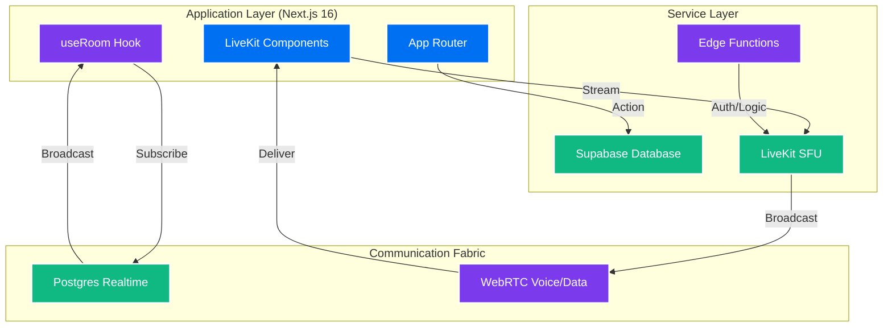
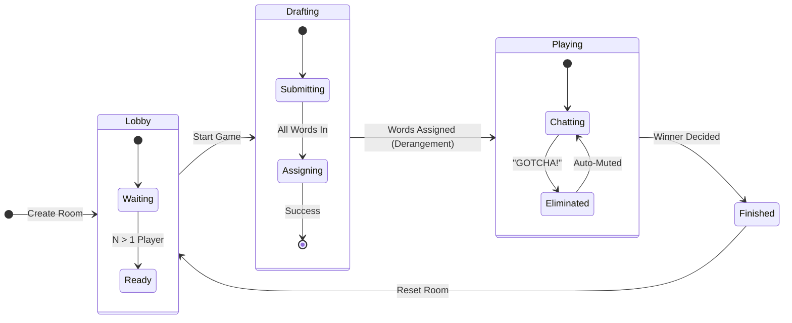
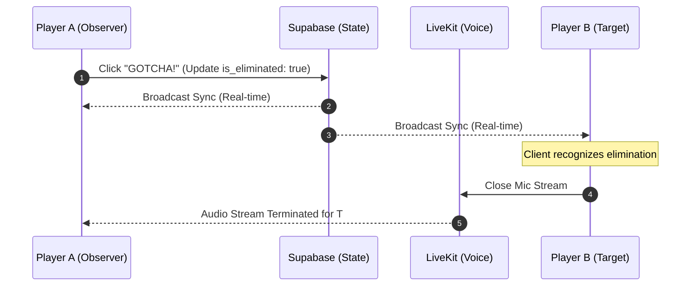

# 🎭 หลุดปาก (Loodpak) — The Forbidden Word Social Game

[](https://nextjs.org/)
[](https://react.dev/)
[](https://tailwindcss.com/)
[](https://supabase.com/)
[](https://livekit.io/)
[](https://www.typescriptlang.org/)

**หลุดปาก (Loodpak)** is a high-octane, real-time voice chat social game where conversation is your weapon—and your biggest weakness. Players must engage in natural dialogue while avoiding a secret "forbidden word" assigned to them by their rivals. 

---

## ✨ Premium Features

- **🎙️ Crystal Clear Voice Chat**: Sub-millisecond latency voice communication powered by LiveKit WebRTC infrastructure.
- **⚡ Instantaneous Sync**: Every "GOTCHA!" and word submission is broadcasted in real-time across all clients using Supabase CDC.
- **🧠 Fair-Play Algorithm**: Implements a robust **Derangement Shuffle** to ensure no player ever receives their own word.
- **🔇 Smart Orchestration**: Automated game state management, including auto-muting for eliminated players.
- **🎨 Comic-Style UI**: A vibrant, high-fidelity interface with fluid animations and custom "comic-shadow" effects.

---

## 🎮 How to Play

1. **The Lobby**: Create/Join a room with a 6-character code.
2. **The Draft**: Every player submits one "forbidden word" for someone else.
3. **The Assignment**: The system shuffles words. You see everyone's word except your own (`???`).
4. **The Game**: Talk naturally. Try to bait others into saying their word.
5. **GOTCHA!**: If someone slips up, hit the button! Last survivor wins.

---

## 🏗️ Technical Architecture

### 1. System Infrastructure
Loodpak uses a "State-as-a-Service" model where Supabase acts as the single source of truth for game state, and LiveKit manages high-concurrency media streams.



### 2. Game Lifecycle (State Transitions)
The game moves through strictly controlled states to ensure data integrity during word assignment and elimination.



### 3. Real-time Data Flow (Sequence)
How the "GOTCHA!" moment works across the stack:



### 4. Database Entity Relationship (ERD)
Our schema is optimized for Postgres replication and cascading deletions.


---

## 🛠️ Technology Stack

| Layer | Technology |
| :--- | :--- |
| **Frontend** | React 19 + Next.js 16 (App Router) |
| **Styling** | Tailwind CSS 4.0 + Lucide Icons |
| **Realtime** | Supabase (Postgres + Realtime CDC) |
| **Voice** | LiveKit (SFU / WebRTC) |
| **Logic** | Derangement Shuffle Algorithm |

---

## 🚀 Quick Start

1. **Install**
   ```bash
   npm install
   ```
2. **Environment**
   Setup `.env.local` with your **Supabase** and **LiveKit** credentials.
3. **Database**
   Run `setup.sql` in your Supabase SQL editor.
4. **Run**
   ```bash
   npm run dev
   ```

---

## 📄 License
Distributed under the MIT License.

<p align="center">Made with ❤️ for party lovers everywhere.</p>
