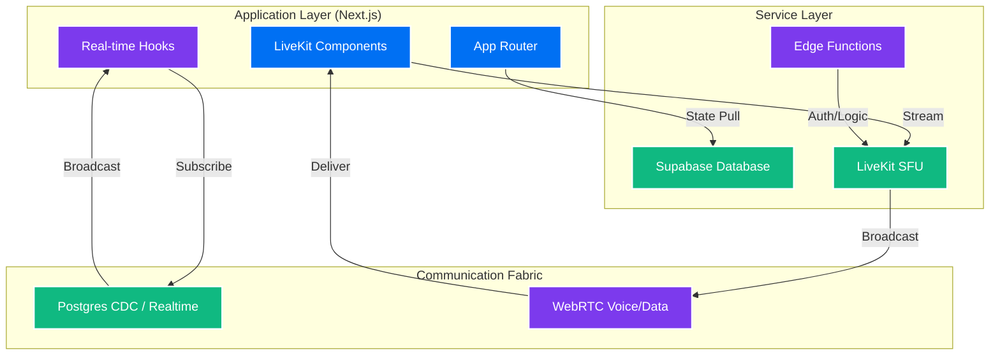
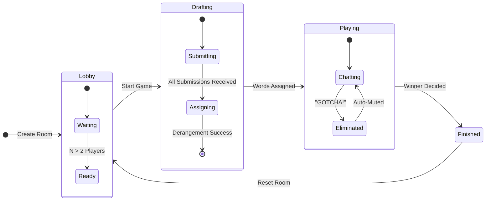
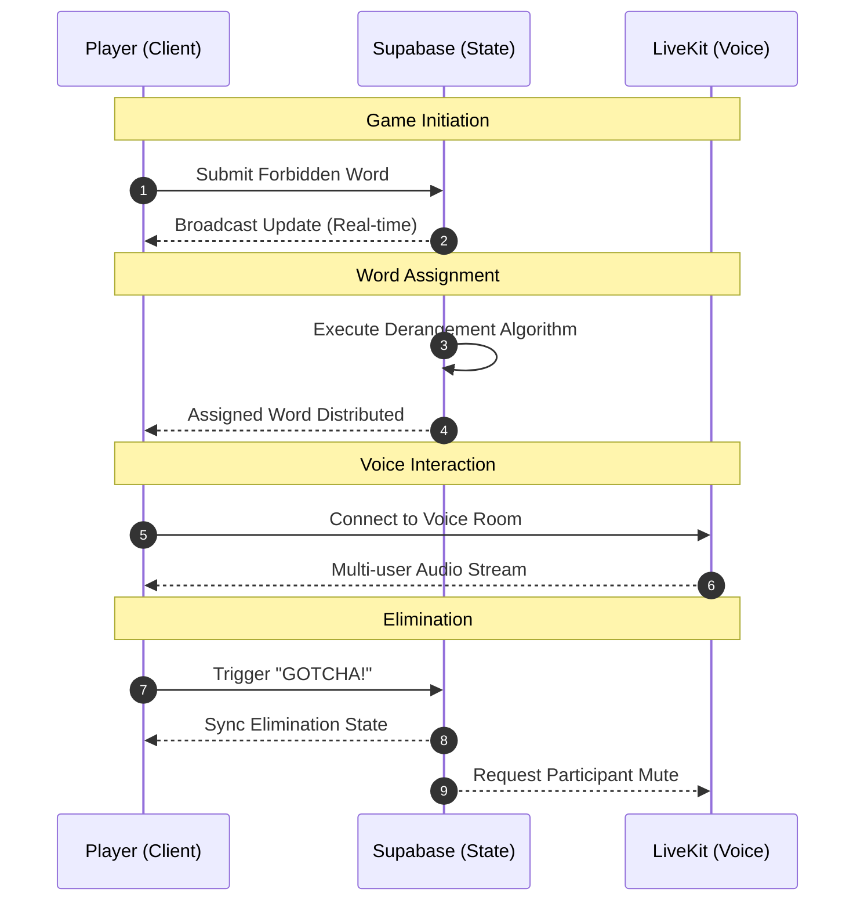
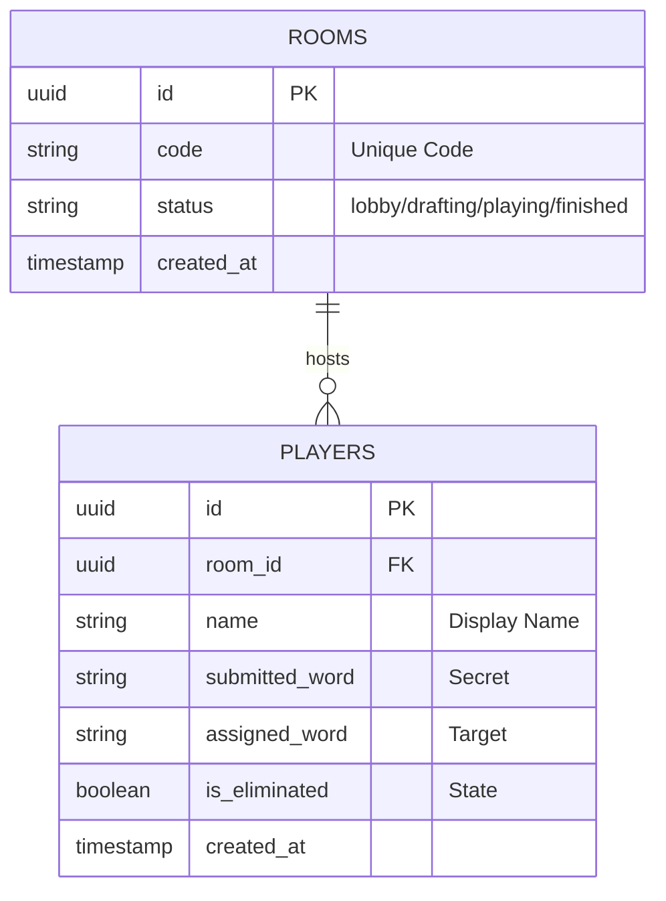

# 🎮 Loodpak

[](https://nextjs.org/)
[](https://www.typescriptlang.org/)
[](https://supabase.com/)
[](https://livekit.io/)
[](https://tailwindcss.com/)

**Loodpak** is a high-performance, real-time voice chat social game designed for modern browsers. Players are challenged to engage in conversation while avoiding specific "forbidden words" assigned to them. The platform leverages WebRTC for low-latency voice communication and Supabase for instantaneous state synchronization across all participants.

---

## ✨ Key Features

- **⚡ Real-time Synchronization**: Powered by Supabase Realtime for sub-second updates across all game clients.
- **🎙️ Low-Latency Voice Chat**: Integrated LiveKit WebRTC infrastructure ensures crystal-clear, real-time communication.
- **🧠 Intelligent Word Assignment**: Implements a robust **Derangement Algorithm** to guarantee equitable word distribution without self-assignment.
- **🔇 Automated Orchestration**: Features smart game state management, including auto-muting of eliminated participants to preserve game integrity.
- **🎨 Modern UI/UX**: A responsive, high-fidelity interface built with Next.js, Tailwind CSS, and Shadcn/ui.
- **🛡️ Type-Safe Architecture**: End-to-end TypeScript implementation for maximum reliability and developer productivity.

---

## 🚀 Quick Start

### Prerequisites

| Tool | Minimum Version |
| :--- | :--- |
| **Node.js** | v18.17.0+ |
| **npm** | v9.0.0+ |
| **Accounts** | Supabase, LiveKit Cloud (Free tier compatible) |

### Installation

1.  **Clone the Repository**
    ```bash
    git clone <your-repo-url>
    cd loodpak
    ```

2.  **Install Dependencies**
    ```bash
    npm install
    ```

3.  **Infrastructure Configuration**
    - **Supabase**: Initialize a new project and execute `setup.sql` in the SQL Editor. Enable **Realtime** for `rooms` and `players` tables.
    - **LiveKit**: Provision a project at [LiveKit Cloud](https://cloud.livekit.io/) to obtain your WebSocket URL and API credentials.

4.  **Environment Setup**
    ```bash
    cp .env.example .env.local
    ```
    Populate `.env.local` with your service credentials:
    ```env
    NEXT_PUBLIC_SUPABASE_URL=your_project_url
    NEXT_PUBLIC_SUPABASE_ANON_KEY=your_anon_key
    NEXT_PUBLIC_LIVEKIT_URL=wss://your-project.livekit.cloud
    LIVEKIT_API_KEY=your_api_key
    LIVEKIT_API_SECRET=your_api_secret
    ```

5.  **Launch Development Environment**
    ```bash
    npm run dev
    ```
    Access the application at `http://localhost:3000`.

---

## 🎮 Gameplay Mechanics

1.  **Room Creation**: A host initializes a session, generating a unique access code.
2.  **Participant Entry**: Players join using the provided room code and their preferred display name.
3.  **Submission Phase**: Every player contributes a "forbidden word" to the pool.
4.  **The Derangement**: Upon starting, the system distributes words such that `assigned_word[i] ≠ submitted_word[i]`.
5.  **Social Engineering**: Participants must talk naturally while attempting to trick others into saying their specific forbidden word.
6.  **Elimination**: When a player is caught, the observer triggers "GOTCHA!", instantly eliminating and muting them.

---

## 🏗️ Technical Architecture

### System Infrastructure



### Lifecycle & State Transitions



### Data Flow Sequence



### Database Entity Relationship



---

## 🛠️ Technology Stack

| Layer | Technologies |
| :--- | :--- |
| **Frontend** | React 19, Next.js 15 (App Router), TypeScript |
| **Styling** | Tailwind CSS 4, Radix UI, Lucide Icons |
| **Database** | Supabase (PostgreSQL + Realtime CDC) |
| **Communications** | LiveKit (WebRTC / SFU) |
| **Logic** | Custom Hooks, Derangement Algorithm |

---

## 📁 Project Structure

```text
src/
├── app/                  # Application routing and API definitions
│   └── api/livekit/      # LiveKit authentication logic
├── components/           # UI and Functional components
│   ├── ui/               # Design system primitives (Shadcn)
│   ├── GameplayArena.tsx # Core game loop container
│   └── VoiceChat.tsx     # WebRTC audio implementation
├── hooks/                # Specialized logic (useRoom, etc.)
├── lib/                  # Core utility functions and clients
│   ├── derangement.ts    # Mathematical word distribution
│   └── roomActions.ts    # Supabase service layer
└── __tests__/            # Algorithmic validation suite
```

---

## 🤝 Contributing

Contributions are welcome! Please feel free to submit a Pull Request. For major changes, please open an issue first to discuss what you would like to change.

1.  Fork the Project
2.  Create your Feature Branch (`git checkout -b feature/AmazingFeature`)
3.  Commit your Changes (`git commit -m 'Add some AmazingFeature'`)
4.  Push to the Branch (`git checkout -p origin feature/AmazingFeature`)
5.  Open a Pull Request

---

## 📄 License

Distributed under the MIT License. See `LICENSE` for more information.

---

## 🙏 Credits

- **Infrastructure**: [Supabase](https://supabase.com), [LiveKit](https://livekit.io)
- **Framework**: [Next.js](https://nextjs.org)
- **UI Components**: [Shadcn/UI](https://ui.shadcn.com)
